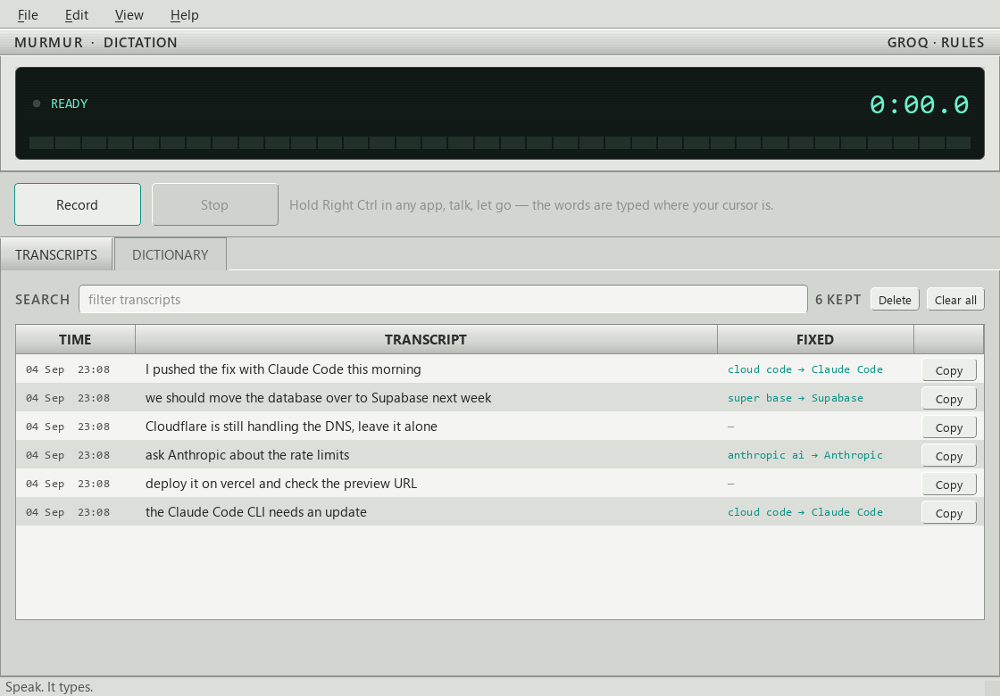

# Murmur

**Speak. It types.**

Push to talk dictation for Windows. Hold a key, talk, let go. The text is
typed into whatever window you are in. Private by default: with the local
engine, your voice never leaves your machine.



## Install

One line, in PowerShell:

    powershell -ExecutionPolicy Bypass -c "irm https://raw.githubusercontent.com/getGit789/murmur/main/install.ps1 | iex"

That downloads the latest release, puts it in
`%LOCALAPPDATA%\Programs\Murmur`, adds a Start Menu entry, asks whether
you want a Desktop shortcut (right-click it to pin Murmur to the
taskbar), registers the app with Windows, and starts it. From then on
Murmur starts quietly with the computer — no window, just the tray icon
and the talk key. No admin rights needed.

Rather click? Download `Murmur-win64.zip` from the
[Releases page](https://github.com/getGit789/murmur/releases), unzip it
anywhere, and run `Murmur.exe`.

Then hold **Right Ctrl** in any app, talk, and let go.

**Out of the box** Murmur listens with a Whisper model on your own CPU —
private, free, no account. **Want it faster?** Get a free API key at
[console.groq.com](https://console.groq.com), open Settings
(**Ctrl+comma**), paste it into the **Groq key** field, and switch the
engine to `groq`. Same free price, cloud speed — and if the network
drops, Murmur quietly falls back to the local model.

## Uninstall

Windows Settings → Apps → Installed apps → **Murmur** → Uninstall.
(Any uninstall tool works too — Murmur registers itself properly.)
Your settings and history are kept; the uninstaller tells you where.
To remove those as well:

    powershell -ExecutionPolicy Bypass -File "%LOCALAPPDATA%\Programs\Murmur\_internal\uninstall.ps1" -All

## The app

A real Windows application, not a tray utility.

- Taskbar icon and Alt+Tab, a resizable window, and a menu bar.
- Settings on **Ctrl+comma**.
- A tray icon as well, but it is secondary. It keeps the hotkey alive
  while you work in another app.
- Closing the window leaves it running in the tray. **Ctrl+Q** quits.

The main window holds the deck (a dark glass display with the record
lamp, status, elapsed counter and level meter, plus Record and Stop),
then two panels:

- **Transcripts** — everything you have dictated. Searchable, with Copy on
  each row, and a **Fixed** column showing which dictionary rules fired.
- **Dictionary** — teach it your words.

## How it works

    [hold hotkey]
          |
          v
    hotkey.py    global key listener (pynput)
          |
          v
    audio.py     records the mic, 16 kHz mono, and reports the live level
          |
      [let go]
          |
          v
    dictionary   MECHANISM 1: your terms are handed to the engine as a
                 short hint BEFORE it listens, so it leans your way
          |
          v
    engines/     audio to text
                   local_whisper.py  on your CPU, private
                   groq_api.py       cloud, faster
          |
          v
    dictionary   MECHANISM 2: the correction pass AFTER it listens.
                 This is the guaranteed path.
          |
          v
    cleanup/     rules.py free and instant, or llm.py via Claude
          |
          v
    inject.py    copies, sends Ctrl+V, restores your clipboard
          |
          v
    history.py   saved to disk so the window can show it again

`ui/controller.py` drives all of it off the UI thread, so the window and
the needle never stutter. The engine layer was not changed to build the
interface.

## The dictionary

File: `%APPDATA%\Murmur\dictionary.toml` — edit it in the app or by hand,
both write the same file.

```toml
terms = ["Anthropic", "Vercel", "Supabase"]

[corrections]
"cloud code" = "Claude Code"
```

**Why two mechanisms.** Biasing is a nudge, not a promise. The correction
pass is what actually guarantees the result.

**The bias list is kept short on purpose.** Only the first 32 terms, and at
most 380 characters, are sent. A long hint makes these models drift and
invent text on quiet audio.

**Glue is handled.** One rule for `cloud code` catches `cloud code`,
`Cloud-Code`, `cloud_code` and `CloudCode`. Longest match wins, so
`cloud code cli` beats `cloud code`.

**Real words are safe.** The pattern must match whole, so a rule for
`cloud code` never touches `Cloudflare`, `cloudcodex`, or the plain word
`cloud`. If you add an entry that would rewrite ordinary English, the app
warns you before saving.

## It learns from you

Heard something wrong? Open **Transcripts**, double-click the line, fix
the word, press Enter. Murmur compares your fix with what it heard,
writes a dictionary rule out of the difference, and stops making that
mistake. Corrected names are also added to the bias list, so the engine
starts leaning toward them before it even listens.

It is careful on purpose. Only short word-for-word swaps are learned; a
rule that would rewrite ordinary English is refused, and rewriting a
whole sentence teaches nothing.

## Design

Tokens live in `src/murmur/ui/tokens.py` — colour, type, space, radius,
border, elevation, motion, size. Every view pulls from them. No one-off
values in components.

The direction is a 1990s MiniDisc deck. Light silver body, honest
Windows-95 bevels, one dark glass display window with bright teal
segments behind it. Teal is the accent (the same family as the tray
icon); red is reserved for the record lamp. Green and amber for levels,
with a peak marker that hangs back and falls slowly, like the hold LED
on real gear. Silkscreen labels, monospaced counters, no drop shadows.

## Run it from source

    run.bat

## Build and install

    build.bat      makes dist\Murmur\Murmur.exe   (about 340 MB)
    install.bat    copies it in and adds a Start Menu entry
    uninstall.bat  removes it, keeps your settings

No admin rights needed. If install says **Sharing violation**, a copy of
Murmur is still running — quit it from the tray, or end it in Task
Manager, then run install again.

For a setup wizard, install [Inno Setup](https://jrsoftware.org/isdl.php)
and run `iscc installer.iss`.

## Files it keeps

    %APPDATA%\Murmur\config.toml       settings
    %APPDATA%\Murmur\dictionary.toml   your words
    %APPDATA%\Murmur\history.jsonl     past transcripts
    %APPDATA%\Murmur\murmur.log        log, for when something breaks

## Not built yet

- Command mode ("make this more formal")

## License

MIT. See [LICENSE](LICENSE).
